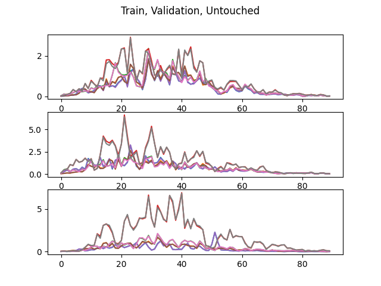

# BrainPad
Classification of EEG signals form the brain through OpenBCI hardware and Tensorflow-Keras API

## Usage
*   #### acquire_fft.py
    This script allows to connect to OpenBCI GUI
    through LSL Protocol and acquire data in form of FFT.  
    For a Cyton board and a Linux machine the setup is the following:
    *   Connect the Ultracortex Helmet with the Cyton Board to your machine
    *   Open OpenBCI GUI
    *   Set this script in the OpenBCI GUI Working Directory
    *   Set in the script the type of acquisition you want, for example [Left, Right, None]
    *   Think at the chosen action and press Enter
 
*   #### live_test.py
    This Python module gives the user a live testing environment of the system.  
    For a Cyton board and a Linux machine the setup is the following:
    *   Connect the Ultracortex Helmet with the Cyton Board to your machine
    *   Open OpenBCI GUI
    *   Set this script in the OpenBCI GUI Working Directory
    *   Think at some action from [Left, Right, None] and check on screen what happens

*   #### dataset_tools.py
    This module provides functionalities for splitting a dataset, loading a dataset
    visualizing data, and handles all the necessary preprocessing.
    
*   #### check_model.py
    Allows to check how well a model is doing on some unseen set of data.
    
*   #### neural_nets.py
    Provides the two different architectures used in this project. 
    *   A very deep architecture: ResNet
    *   A simplistic architecture based upon the knowledge from:   https://iopscience.iop.org/article/10.1088/1741-2552/ab0ab5/meta 
    
## Confusion Matrix so far:

## How the model sees data:

## A look at our samples:

## The Neural Network so far:
