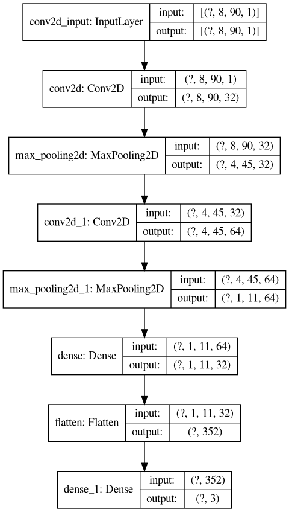

# BrainPad
Classification of EEG signals form the brain through OpenBCI hardware and Tensorflow-Keras API

## Usage
*   #### acquire_fft.py
    This script allows to connect to OpenBCI GUI
    through LSL Protocol and acquire data in form of FFT.
    For a Cyton board the setup is the following for a Linux machine:
    *   Open OpenBCI GUI
    *   Set this script in the OpenBCI GUI Working Directory
    *   Set in the script the type of acquisition you want, for example [Left, Right, None]
    *   Think at the chosen action and press Enter
 

## Neural Network so far:
