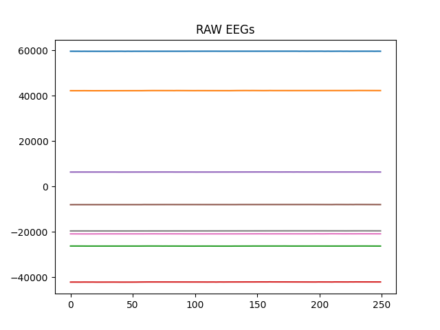
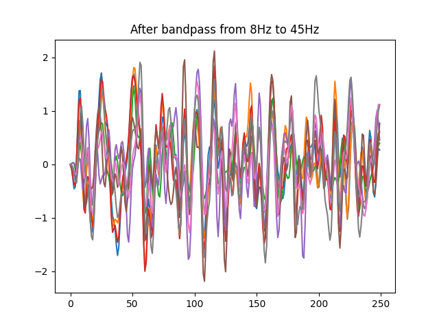

# BrainPad

Classification of EEG signals from the brain through OpenBCI hardware and Tensorflow-Keras API

  

   

## Data Acquisition:
The "data" folder provides the current EEG samples taken following this protocol: 
The person sits in a comfortable position on a chair and follows the `acquire_eeg.py`
protocol. When the program tells to think "hands" the subject imagines opening and closing
both hands. If "none" is presented the subject can wonder, and think at something else.
If "feet" is presented the subject imagines moving the feet up and down.  
The subject does not blink during acquisitions.

Each sample is stored as a numpy 2D array in an .npy file that has the following shape: 
`(8, 250)`

## Usage
*   #### acquire_eeg.py
    This script allows to connect to OpenBCI Cyton board through BrainFlow
    and acquire data in form of raw EEG.  
    For a Cyton board and a Linux machine the setup is the following:
    *   Connect the Ultracortex Helmet with the Cyton Board to your machine
    *   Run the script and follow the acquisition protocol
    
*   #### acquire_fft.py
    This script allows to connect to OpenBCI GUI
    through LSL Protocol and acquire data in form of FFT.  
    For a Cyton board and a Linux machine the setup is the following:
    *   Connect the Ultracortex Helmet with the Cyton Board to your machine
    *   Open OpenBCI GUI
    *   Set this script in the OpenBCI GUI Working Directory
    *   Set in the script the type of acquisition you want, for example [Left, Right, None]
    *   Think at the chosen action and press Enter
    
    Since the LSL support is deprecated, use the acquire_eeg.py and then transform to FFT.
 
*   #### live_test.py
    This Python module gives the user a live testing environment of the system.  
    For a Cyton board and a Linux machine the setup is the following:
    *   Connect the Ultracortex Helmet with the Cyton Board to your machine
    *   Open OpenBCI GUI
    *   Set this script in the OpenBCI GUI Working Directory
    *   Mimic the motor imagery tasks you did in the acquisition protocol and check on screen what happens.
    
    I will update to a BrainFlow version very soon.

*   #### dataset_tools.py
    This module provides functionalities for splitting a dataset, loading a dataset
    visualizing data, and handles all the necessary preprocessing.
    
*   #### check_model.py
    Allows to check how well a model is doing on some unseen set of data.
    
*   #### neural_nets.py
    Provides three different architectures used in this project. 
    *   A very deep architecture: ResNet
    *   A simplistic architecture based upon the knowledge from:   https://iopscience.iop.org/article/10.1088/1741-2552/ab0ab5/meta 
    *   TA-CSPNN made for motor imagery classification tasks, all credits to:
       https://github.com/mahtamsv/TA-CSPNN/blob/master/TA_CSPNN.py
       https://ieeexplore.ieee.org/document/8857423
    
## Confusion Matrix so far:

## A look at our samples:

## How the crisnet model sees data:

## The Best Neural Network so far:

